# ET Turina v10: figuras y código Mermaid

Cada bloque es una figura de la ET v10 (`ET_Turinav10_09-11.docx`), con su número y título. Para verlo o editarlo, pegá el bloque en https://mermaid.live o abrí este archivo en VS Code con la extensión "Markdown Preview Mermaid Support".

**Estado de cada figura respecto del código del 09-11**

| Fig. | Título | Tipo | ¿Hay que rehacer la imagen? |
|---|---|---|---|
| 1 | Conexiones | Mermaid | **Sí**: pines nuevos (GP18/GP20, GP19/GP21, frenos GP26) |
| 2 | Arquitectura de implementación | Mermaid | **Sí**: pines y watchdog |
| 3 | Hilos y buffers de stream.py | Mermaid | Sí, menor: mensaje ESTADO y latencia |
| 4 | Enlace con la vincha y verificación | Mermaid | No había código: nuevo |
| 5 | Captura de datos de la vincha | Mermaid | No había código: nuevo |
| 6 | Captura de bioseñales y contacto | Mermaid | No había código: nuevo (agrega touching_forehead) |
| 7 | Validación en la Pi y en la Pico | Mermaid | No había código: nuevo (validación nueva y vincha al revés) |
| 8 | Procesamiento del acelerómetro y del EEG | Mermaid | No |
| 9 | (sin título en el Word) | Gráfico Python | Revisar el título que falta |
| 10, 11, 12 | Filtros, zona muerta, potencia | Gráfico Python | No |
| 13 | Señal que analiza el detector | Mermaid | No |
| 14 | Orden de las reglas | Mermaid | **Sí**: reglas 4 y 11 |
| 15 | Umbral adaptativo | Mermaid | No |
| 16 | Decisión según la calidad de los electrodos | Mermaid | **Sí**: 0,7 s, frente, Marcha limitada 5 s |
| 17 | Calibración del ruido base | Mermaid | **Sí**: REPOSO y salida de Emergencia |
| 18 | Máquina de estados | Mermaid | **Sí**: transiciones nuevas |
| 19 | Ciclo de 50 ms | Mermaid | **Sí**: tiempos de falla y Marcha limitada |
| 20 | Arranque (CU-01) | Mermaid | Sí, menor: REPOSO |
| 21 | Activación y desactivación (CU-02) | Mermaid | **Sí**: rampa 1,5 s, frenos, REPOSO |
| 22 | Control diferencial | Mermaid | No |
| 23 | PWM con rampa | Mermaid | **Sí**: rampa 1,5 s, pines, frenos |
| 24 | Cambio de sentido | Mermaid | **Sí**: 40 ms |
| 25 | Rampa ante cambios y corte | Gráfico Python | **Sí si se hizo con 1,0 s**: rehacer con 1,5 s |
| 26 | Pérdida de enlace | Mermaid | Sí, menor: frenos y vuelta a Calibración |
| 27 | Vigilancia y watchdog | Mermaid | **Sí**: watchdog desde la 1.ª trama, no con USB, SIN ENLACE |
| 28 | Salidas de monitoreo | Mermaid | No había código: nuevo |
| 29 | Pantalla OLED | Mermaid | **Sí**: contenido nuevo |
| 30 | Latencia | Mermaid | **Sí**: latencia_ms y latencia_uart_ms |

---

## Figura 1. Conexiones entre la Raspberry Pi, la Pico, la pantalla y el puente H

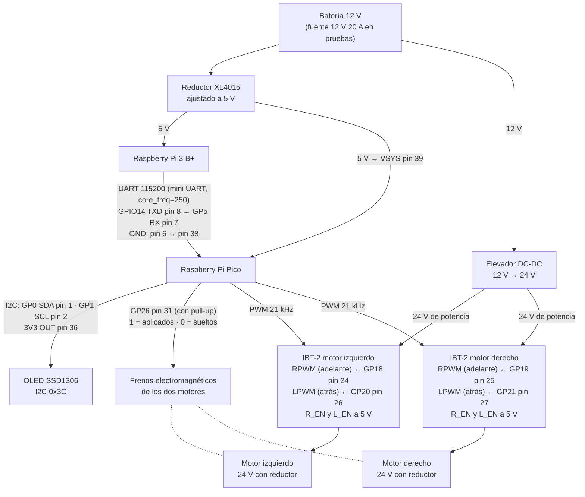
```mermaid
flowchart TD
  BAT["Batería 12 V<br/>(fuente 12 V 20 A en pruebas)"] --> XL["Reductor XL4015<br/>ajustado a 5 V"]
  XL -->|"5 V"| PI["Raspberry Pi 3 B+"]
  XL -->|"5 V → VSYS pin 39"| PICO
  PI -->|"UART 115200 (mini UART, core_freq=250)<br/>GPIO14 TXD pin 8 → GP5 RX pin 7<br/>GND: pin 6 ↔ pin 38"| PICO["Raspberry Pi Pico"]
  PICO -->|"I2C: GP0 SDA pin 1 · GP1 SCL pin 2<br/>3V3 OUT pin 36"| OL["OLED SSD1306<br/>I2C 0x3C"]
  PICO -->|"GP26 pin 31 (con pull-up)<br/>1 = aplicados · 0 = sueltos"| FR["Frenos electromagnéticos<br/>de los dos motores"]
  PICO -->|"PWM 21 kHz"| BT1["IBT-2 motor izquierdo<br/>RPWM (adelante) ← GP18 pin 24<br/>LPWM (atrás) ← GP20 pin 26<br/>R_EN y L_EN a 5 V"]
  PICO -->|"PWM 21 kHz"| BT2["IBT-2 motor derecho<br/>RPWM (adelante) ← GP19 pin 25<br/>LPWM (atrás) ← GP21 pin 27<br/>R_EN y L_EN a 5 V"]
  BAT -->|"12 V"| UP["Elevador DC-DC<br/>12 V → 24 V"]
  UP -->|"24 V de potencia"| BT1
  UP -->|"24 V de potencia"| BT2
  BT1 --> M1["Motor izquierdo<br/>24 V con reductor"]
  BT2 --> M2["Motor derecho<br/>24 V con reductor"]
  FR -.- M1
  FR -.- M2
```

## Figura 2. Arquitectura de implementación

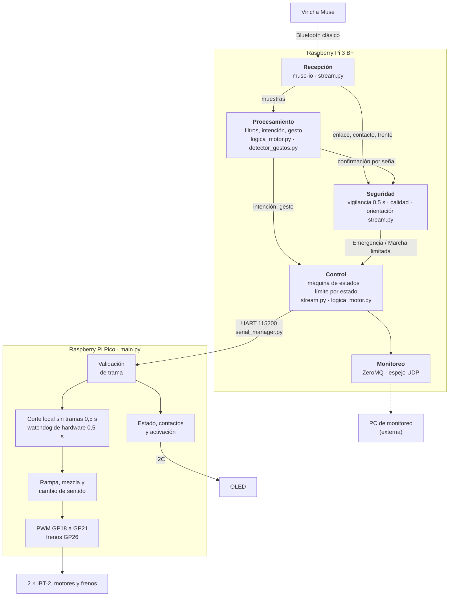
```mermaid
flowchart TD
  M["Vincha Muse"] -->|"Bluetooth clásico"| REC
  subgraph PI["Raspberry Pi 3 B+"]
    REC["<b>Recepción</b><br/>muse-io · stream.py"]
    PRO["<b>Procesamiento</b><br/>filtros, intención, gesto<br/>logica_motor.py · detector_gestos.py"]
    SEG["<b>Seguridad</b><br/>vigilancia 0,5 s · calidad · orientación<br/>stream.py"]
    CON["<b>Control</b><br/>máquina de estados · límite por estado<br/>stream.py · logica_motor.py"]
    MON["<b>Monitoreo</b><br/>ZeroMQ · espejo UDP"]
    REC -->|"muestras"| PRO
    REC -->|"enlace, contacto, frente"| SEG
    PRO -->|"confirmación por señal"| SEG
    PRO -->|"intención, gesto"| CON
    SEG -->|"Emergencia / Marcha limitada"| CON
    CON --> MON
  end
  CON -->|"UART 115200<br/>serial_manager.py"| VAL
  subgraph PICO["Raspberry Pi Pico · main.py"]
    VAL["Validación<br/>de trama"] --> VIG["Corte local sin tramas 0,5 s<br/>watchdog de hardware 0,5 s"]
    VIG --> RAM["Rampa, mezcla y<br/>cambio de sentido"] --> GEN["PWM GP18 a GP21<br/>frenos GP26"]
    VAL --> IND["Estado, contactos<br/>y activación"]
  end
  GEN --> PH["2 × IBT-2, motores y frenos"]
  IND -->|"I2C"| OL["OLED"]
  MON -.-> PC["PC de monitoreo<br/>(externa)"]
```

## Figura 3. Hilos y buffers de stream.py

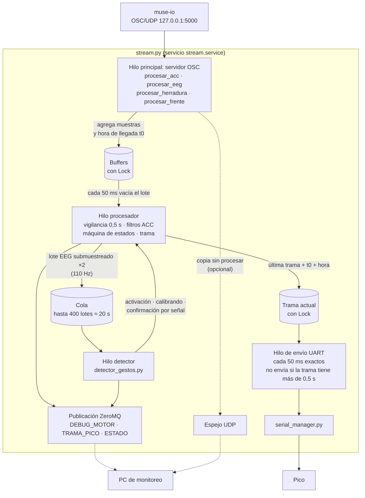
```mermaid
flowchart TD
  IO["muse-io<br/>OSC/UDP 127.0.0.1:5000"] --> SRV
  subgraph ST["stream.py (servicio stream.service)"]
    SRV["Hilo principal: servidor OSC<br/>procesar_acc · procesar_eeg<br/>procesar_herradura · procesar_frente"] -->|"agrega muestras<br/>y hora de llegada t0"| BUF[("Buffers<br/>con Lock")]
    BUF -->|"cada 50 ms vacía el lote"| PROC["Hilo procesador<br/>vigilancia 0,5 s · filtros ACC<br/>máquina de estados · trama"]
    PROC -->|"lote EEG submuestreado ×2<br/>(110 Hz)"| COLA[("Cola<br/>hasta 400 lotes ≈ 20 s")]
    COLA --> DET["Hilo detector<br/>detector_gestos.py"]
    DET -->|"activación · calibrando ·<br/>confirmación por señal"| PROC
    PROC -->|"última trama + t0 + hora"| TRA[("Trama actual<br/>con Lock")]
    TRA --> ENV["Hilo de envío UART<br/>cada 50 ms exactos<br/>no envía si la trama tiene más de 0,5 s"]
    ENV --> SER["serial_manager.py"]
    PROC --> PUB["Publicación ZeroMQ<br/>DEBUG_MOTOR · TRAMA_PICO · ESTADO"]
    DET --> PUB
    SRV -.->|"copia sin procesar<br/>(opcional)"| UDP["Espejo UDP"]
  end
  SER --> PICO["Pico"]
  PUB -.-> PC["PC de monitoreo"]
  UDP -.-> PC
```

## Figura 4. Enlace con la vincha y verificación

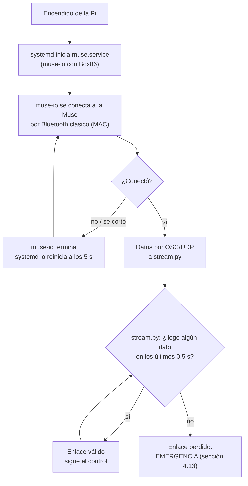
```mermaid
flowchart TD
  ON["Encendido de la Pi"] --> SD["systemd inicia muse.service<br/>(muse-io con Box86)"]
  SD --> BT["muse-io se conecta a la Muse<br/>por Bluetooth clásico (MAC)"]
  BT --> OK{"¿Conectó?"}
  OK -->|"no / se cortó"| RE["muse-io termina<br/>systemd lo reinicia a los 5 s"]
  RE --> BT
  OK -->|"sí"| OSC["Datos por OSC/UDP<br/>a stream.py"]
  OSC --> V{"stream.py: ¿llegó algún dato<br/>en los últimos 0,5 s?"}
  V -->|"sí"| SIG["Enlace válido<br/>sigue el control"]
  V -->|"no"| EM["Enlace perdido:<br/>EMERGENCIA (sección 4.13)"]
  SIG --> V
```

## Figura 5. Captura de datos de la vincha

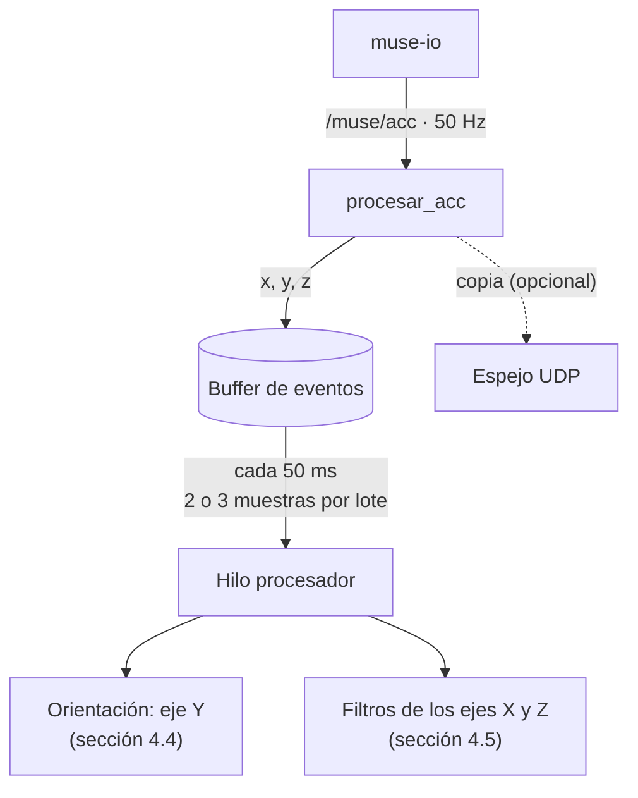
```mermaid
flowchart TD
  IO["muse-io"] -->|"/muse/acc · 50 Hz"| ACC["procesar_acc"]
  ACC -->|"x, y, z"| BE[("Buffer de eventos")]
  ACC -.->|"copia (opcional)"| UDP["Espejo UDP"]
  BE -->|"cada 50 ms<br/>2 o 3 muestras por lote"| PROC["Hilo procesador"]
  PROC --> ORI["Orientación: eje Y<br/>(sección 4.4)"]
  PROC --> FIL["Filtros de los ejes X y Z<br/>(sección 4.5)"]
```

## Figura 6. Captura de bioseñales y contacto de los electrodos

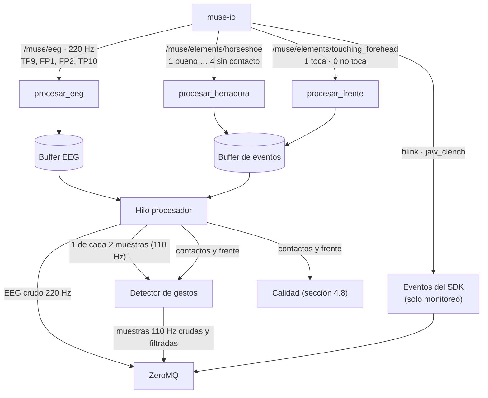
```mermaid
flowchart TD
  IO["muse-io"] -->|"/muse/eeg · 220 Hz<br/>TP9, FP1, FP2, TP10"| EEG["procesar_eeg"]
  IO -->|"/muse/elements/horseshoe<br/>1 bueno … 4 sin contacto"| HS["procesar_herradura"]
  IO -->|"/muse/elements/touching_forehead<br/>1 toca · 0 no toca"| FRN["procesar_frente"]
  IO -->|"blink · jaw_clench"| SDK["Eventos del SDK<br/>(solo monitoreo)"]
  EEG --> BEEG[("Buffer EEG")]
  HS --> BEV[("Buffer de eventos")]
  FRN --> BEV
  BEEG --> PROC["Hilo procesador"]
  BEV --> PROC
  PROC -->|"1 de cada 2 muestras (110 Hz)"| DET["Detector de gestos"]
  PROC -->|"contactos y frente"| DET
  PROC -->|"contactos y frente"| CAL["Calidad (sección 4.8)"]
  PROC -->|"EEG crudo 220 Hz"| PUB["ZeroMQ"]
  DET -->|"muestras 110 Hz crudas y filtradas"| PUB
  SDK --> PUB
```

## Figura 7. Validación en la Pi y en la Pico

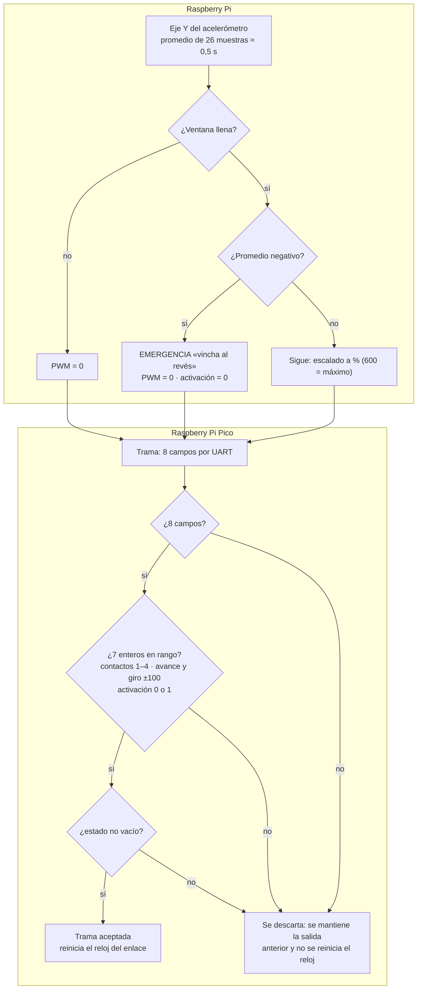
```mermaid
flowchart TD
  subgraph SPI["Raspberry Pi"]
    Y["Eje Y del acelerómetro<br/>promedio de 26 muestras ≈ 0,5 s"] --> L{"¿Ventana llena?"}
    L -->|"no"| Z["PWM = 0"]
    L -->|"sí"| N{"¿Promedio negativo?"}
    N -->|"sí"| EM["EMERGENCIA «vincha al revés»<br/>PWM = 0 · activación = 0"]
    N -->|"no"| OKP["Sigue: escalado a % (600 = máximo)"]
  end
  OKP --> T["Trama: 8 campos por UART"]
  EM --> T
  Z --> T
  subgraph SPICO["Raspberry Pi Pico"]
    T --> C1{"¿8 campos?"}
    C1 -->|"sí"| C2{"¿7 enteros en rango?<br/>contactos 1–4 · avance y giro ±100<br/>activación 0 o 1"}
    C2 -->|"sí"| C3{"¿estado no vacío?"}
    C3 -->|"sí"| ACEP["Trama aceptada<br/>reinicia el reloj del enlace"]
    C1 -->|"no"| DESC["Se descarta: se mantiene la salida<br/>anterior y no se reinicia el reloj"]
    C2 -->|"no"| DESC
    C3 -->|"no"| DESC
  end
```

## Figura 8. Procesamiento del acelerómetro y del EEG

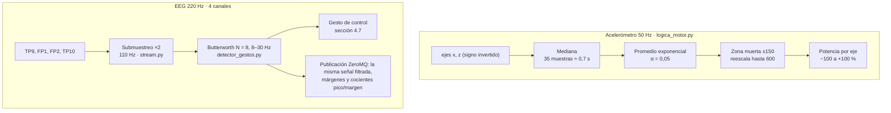
```mermaid
flowchart TD
  subgraph IMU["Acelerómetro 50 Hz · logica_motor.py"]
    A["ejes x, z (signo invertido)"] --> MED["Mediana<br/>35 muestras ≈ 0,7 s"]
    MED --> EMA["Promedio exponencial<br/>α = 0,05"]
    EMA --> ZM["Zona muerta ±150<br/>reescala hasta 600"]
    ZM --> P["Potencia por eje<br/>−100 a +100 %"]
  end
  subgraph EEG["EEG 220 Hz · 4 canales"]
    E["TP9, FP1, FP2, TP10"] --> SM["Submuestreo ×2<br/>110 Hz · stream.py"]
    SM --> F2["Butterworth N = 8, 8–30 Hz<br/>detector_gestos.py"]
    F2 --> G["Gesto de control<br/>sección 4.7"]
    F2 --> D["Publicación ZeroMQ: la misma señal filtrada,<br/>márgenes y cocientes pico/margen"]
  end
```

## Figuras 9, 10, 11, 12 y 25

Son gráficos hechos con Python, no Mermaid. La 9 no tiene título en el Word. Las 10, 11 y 12 no cambian. La 25 (rampa ante cambios y corte) hay que rehacerla con la rampa de 1,5 s si se hizo con la de 1,0 s.

## Figura 13. Señal que analiza el detector de gestos

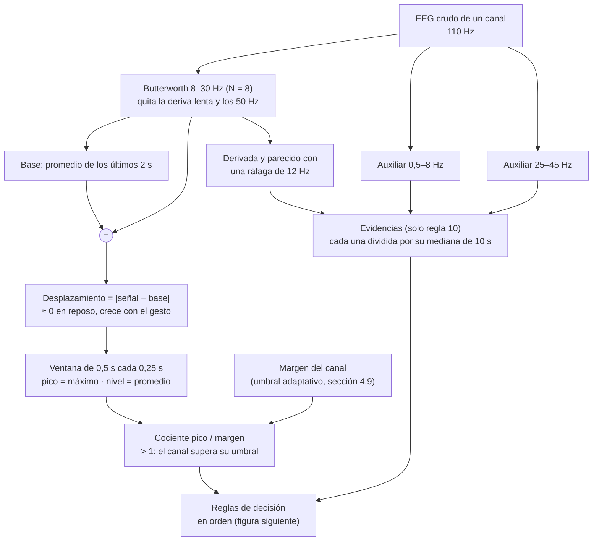
```mermaid
%%{init: {"flowchart": {"wrappingWidth": 300}}}%%
flowchart TD
  A["EEG crudo de un canal<br/>110 Hz"] --> F["Butterworth 8–30 Hz (N = 8)<br/>quita la deriva lenta y los 50 Hz"]
  F --> BASE["Base: promedio de los últimos 2 s"]
  F --> RES(("−"))
  BASE --> RES
  RES --> ABS["Desplazamiento = |señal − base|<br/>≈ 0 en reposo, crece con el gesto"]
  ABS --> V["Ventana de 0,5 s cada 0,25 s<br/>pico = máximo · nivel = promedio"]
  M["Margen del canal<br/>(umbral adaptativo, sección 4.9)"] --> Q
  V --> Q["Cociente pico / margen<br/>&gt; 1: el canal supera su umbral"]
  Q --> R["Reglas de decisión<br/>en orden (figura siguiente)"]
  A --> LP["Auxiliar 0,5–8 Hz"]
  A --> HP["Auxiliar 25–45 Hz"]
  F --> DER["Derivada y parecido con<br/>una ráfaga de 12 Hz"]
  LP --> EV["Evidencias (solo regla 10)<br/>cada una dividida por su mediana de 10 s"]
  HP --> EV
  DER --> EV
  EV --> R
```

## Figura 14. Orden de las reglas de decisión del detector

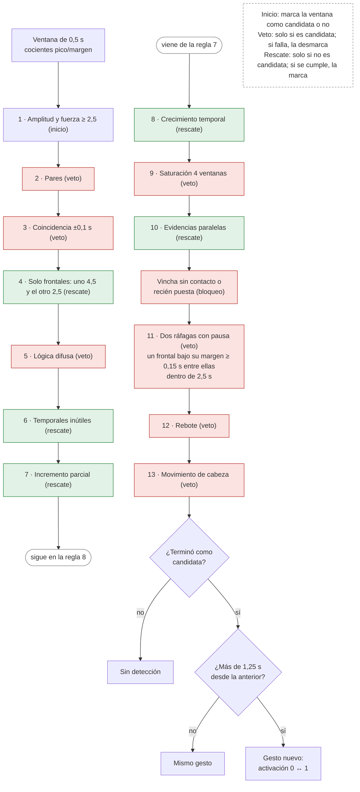
```mermaid
flowchart TD
  W["Ventana de 0,5 s<br/>cocientes pico/margen"] --> R1
  R1["1 · Amplitud y fuerza ≥ 2,5 (inicio)"] --> R2["2 · Pares (veto)"] --> R3["3 · Coincidencia ±0,1 s (veto)"] --> R4["4 · Solo frontales: uno 4,5 y el otro 2,5 (rescate)"] --> R5["5 · Lógica difusa (veto)"] --> R6["6 · Temporales inútiles (rescate)"] --> R7["7 · Incremento parcial (rescate)"]
  R7 --> C1(["sigue en la regla 8"])
  C2(["viene de la regla 7"]) --> R8["8 · Crecimiento temporal (rescate)"] --> R9["9 · Saturación 4 ventanas (veto)"] --> R10["10 · Evidencias paralelas (rescate)"] --> B["Vincha sin contacto o<br/>recién puesta (bloqueo)"] --> R11["11 · Dos ráfagas con pausa (veto)<br/>un frontal bajo su margen ≥ 0,15 s entre ellas<br/>dentro de 2,5 s"] --> R12["12 · Rebote (veto)"] --> R13["13 · Movimiento de cabeza (veto)"]
  R13 --> D{"¿Terminó como<br/>candidata?"}
  D -->|"no"| N["Sin detección"]
  D -->|"sí"| S{"¿Más de 1,25 s<br/>desde la anterior?"}
  S -->|"no"| N2["Mismo gesto"]
  S -->|"sí"| T["Gesto nuevo:<br/>activación 0 ↔ 1"]
  L1["Inicio: marca la ventana como candidata o no<br/>Veto: solo si es candidata; si falla, la desmarca<br/>Rescate: solo si no es candidata; si se cumple, la marca"]
  style L1 fill:#FFFFFF,stroke:#888,stroke-dasharray: 4 3
  style R2 fill:#FBE3E1,stroke:#B3261E
  style R3 fill:#FBE3E1,stroke:#B3261E
  style R5 fill:#FBE3E1,stroke:#B3261E
  style R9 fill:#FBE3E1,stroke:#B3261E
  style B fill:#FBE3E1,stroke:#B3261E
  style R11 fill:#FBE3E1,stroke:#B3261E
  style R12 fill:#FBE3E1,stroke:#B3261E
  style R13 fill:#FBE3E1,stroke:#B3261E
  style R4 fill:#E3F2E6,stroke:#1E7B34
  style R6 fill:#E3F2E6,stroke:#1E7B34
  style R7 fill:#E3F2E6,stroke:#1E7B34
  style R8 fill:#E3F2E6,stroke:#1E7B34
  style R10 fill:#E3F2E6,stroke:#1E7B34
  style C1 fill:#FFFFFF,stroke:#888
  style C2 fill:#FFFFFF,stroke:#888
```

## Figura 15. Umbral adaptativo de cada canal

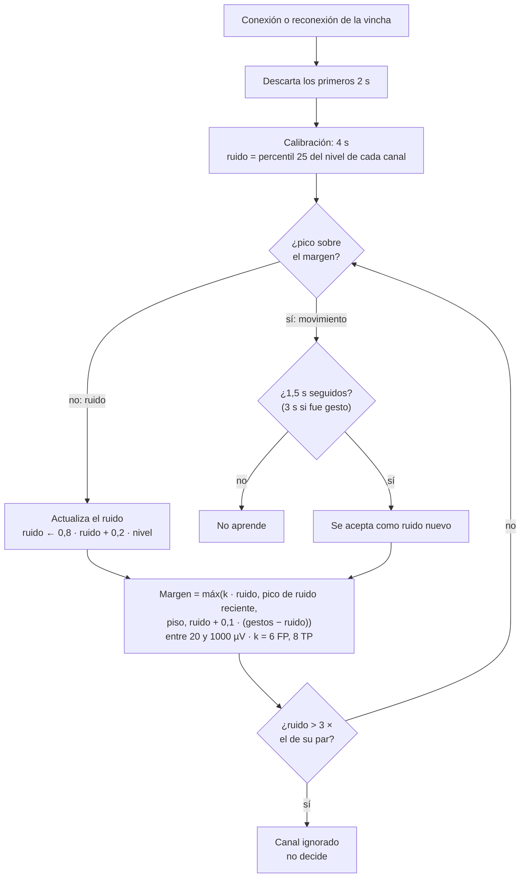
```mermaid
%%{init: {"flowchart": {"wrappingWidth": 330}}}%%
flowchart TD
  S["Conexión o reconexión de la vincha"] --> SK["Descarta los primeros 2 s"]
  SK --> A["Calibración: 4 s<br/>ruido = percentil 25 del nivel de cada canal"]
  A --> B{"¿pico sobre<br/>el margen?"}
  B -->|"no: ruido"| C["Actualiza el ruido<br/>ruido ← 0,8 · ruido + 0,2 · nivel"]
  B -->|"sí: movimiento"| D{"¿1,5 s seguidos?<br/>(3 s si fue gesto)"}
  D -->|"no"| X["No aprende"]
  D -->|"sí"| C2["Se acepta como ruido nuevo"]
  C --> E["Margen = máx(k · ruido, pico de ruido reciente,<br/>piso, ruido + 0,1 · (gestos − ruido))<br/>entre 20 y 1000 µV · k = 6 FP, 8 TP"]
  C2 --> E
  E --> F{"¿ruido > 3 ×<br/>el de su par?"}
  F -->|"sí"| I["Canal ignorado<br/>no decide"]
  F -->|"no"| B
```

## Figura 16. Decisión según la calidad de los electrodos

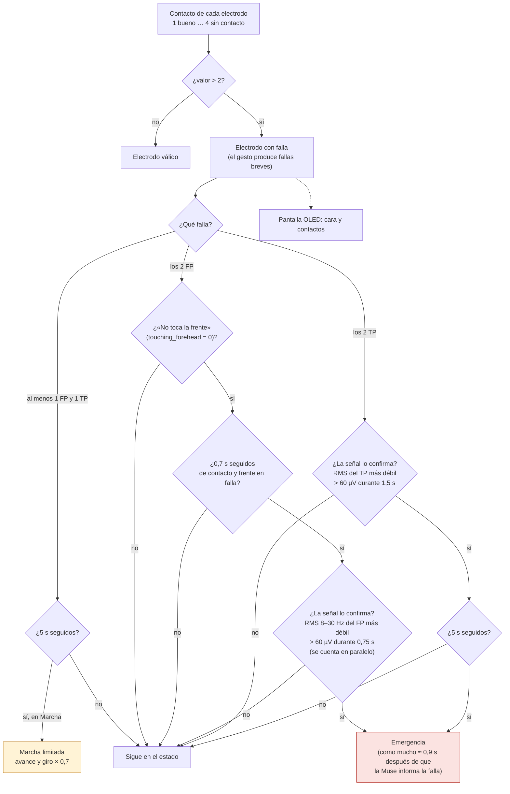
```mermaid
flowchart TD
  H["Contacto de cada electrodo<br/>1 bueno … 4 sin contacto"] --> F{"¿valor > 2?"}
  F -->|"no"| N["Electrodo válido"]
  F -->|"sí"| C["Electrodo con falla<br/>(el gesto produce fallas breves)"]
  C --> K{"¿Qué falla?"}
  K -->|"al menos 1 FP y 1 TP"| L5{"¿5 s seguidos?"}
  L5 -->|"sí, en Marcha"| L["Marcha limitada<br/>avance y giro × 0,7"]
  L5 -->|"no"| W["Sigue en el estado"]
  K -->|"los 2 FP"| FR{"¿«No toca la frente»<br/>(touching_forehead = 0)?"}
  FR -->|"no"| W
  FR -->|"sí"| T1{"¿0,7 s seguidos<br/>de contacto y frente en falla?"}
  T1 -->|"no"| W
  T1 -->|"sí"| SG1{"¿La señal lo confirma?<br/>RMS 8–30 Hz del FP más débil<br/>&gt; 60 µV durante 0,75 s<br/>(se cuenta en paralelo)"}
  SG1 -->|"sí"| EM["Emergencia<br/>(como mucho ≈ 0,9 s después de que<br/>la Muse informa la falla)"]
  SG1 -->|"no"| W
  K -->|"los 2 TP"| SG2{"¿La señal lo confirma?<br/>RMS del TP más débil<br/>&gt; 60 µV durante 1,5 s"}
  SG2 -->|"no"| W
  SG2 -->|"sí"| T2{"¿5 s seguidos?"}
  T2 -->|"sí"| EM
  T2 -->|"no"| W
  C -.-> OL["Pantalla OLED: cara y contactos"]
  style EM fill:#FBE3E1,stroke:#B3261E
  style L fill:#FFF3D6,stroke:#B36B00
```

## Figura 17. Calibración del ruido base en el detector

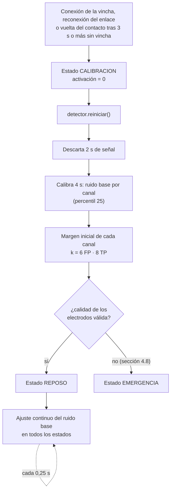
```mermaid
flowchart TD
  A["Conexión de la vincha, reconexión del enlace<br/>o vuelta del contacto tras 3 s o más sin vincha"] --> ST["Estado CALIBRACION<br/>activación = 0"]
  ST --> R["detector.reiniciar()"]
  R --> SK["Descarta 2 s de señal"]
  SK --> C["Calibra 4 s: ruido base por canal<br/>(percentil 25)"]
  C --> M["Margen inicial de cada canal<br/>k = 6 FP · 8 TP"]
  M --> Q{"¿calidad de los<br/>electrodos válida?"}
  Q -->|"sí"| RA["Estado REPOSO"]
  Q -->|"no (sección 4.8)"| EM["Estado EMERGENCIA"]
  RA --> AD["Ajuste continuo del ruido base<br/>en todos los estados"]
  AD -.->|"cada 0,25 s"| AD
```

## Figura 18. Máquina de estados

```mermaid
flowchart TD
  S0(( )) --> I
  I(["INICIO<br/>PWM = 0"]) -->|"llegan datos de la vincha"| C(["CALIBRACION<br/>activación = 0"])
  C -->|"ruido base medido y<br/>calidad válida"| R(["REPOSO<br/>activación = 0 · frenos aplicados"])
  R -->|"doble gesto"| M(["MARCHA<br/>PWM diferencial con rampa"])
  M -->|"doble gesto"| R
  M -->|"1 FP y 1 TP en falla<br/>5 s seguidos"| L(["MARCHA LIMITADA<br/>avance y giro × 0,7"])
  L -->|"deja de cumplirse"| M
  L -->|"doble gesto"| R
  M -->|"pérdida de enlace 0,5 s ·<br/>vincha al revés · 2 FP 0,7 s · 2 TP 5 s"| E(["EMERGENCIA<br/>PWM = 0 sin rampa · activación = 0"])
  L --> E
  R --> E
  C --> E
  E -->|"enlace recuperado, o contacto<br/>tras 3 s o más sin vincha"| C
  E -->|"contacto recuperado antes de 3 s<br/>(espera 1 s) · vincha acomodada"| R
  style S0 fill:#333,stroke:#333
  style E fill:#FBE3E1,stroke:#B3261E
  style M fill:#E3F2E6,stroke:#1E7B34
  style L fill:#FFF3D6,stroke:#B36B00
```

## Figura 19. Ciclo de 50 ms del hilo procesador con la máquina de estados

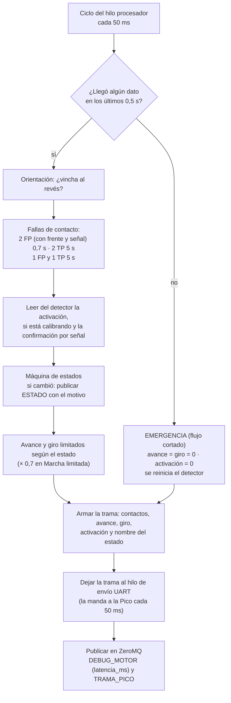
```mermaid
flowchart TD
  T0["Ciclo del hilo procesador<br/>cada 50 ms"] --> L{"¿Llegó algún dato<br/>en los últimos 0,5 s?"}
  L -->|"no"| EM["EMERGENCIA (flujo cortado)<br/>avance = giro = 0 · activación = 0<br/>se reinicia el detector"]
  L -->|"sí"| O["Orientación: ¿vincha al revés?"]
  O --> Q["Fallas de contacto:<br/>2 FP (con frente y señal) 0,7 s · 2 TP 5 s<br/>1 FP y 1 TP 5 s"]
  Q --> G["Leer del detector la activación,<br/>si está calibrando y la confirmación por señal"]
  G --> SM["Máquina de estados<br/>si cambió: publicar ESTADO con el motivo"]
  SM --> CT["Avance y giro limitados según el estado<br/>(× 0,7 en Marcha limitada)"]
  CT --> TR["Armar la trama: contactos, avance, giro,<br/>activación y nombre del estado"]
  EM --> TR
  TR --> TX["Dejar la trama al hilo de envío UART<br/>(la manda a la Pico cada 50 ms)"]
  TX --> PUB["Publicar en ZeroMQ<br/>DEBUG_MOTOR (latencia_ms) y TRAMA_PICO"]
```

## Figura 20. Arranque del sistema (CU-01)

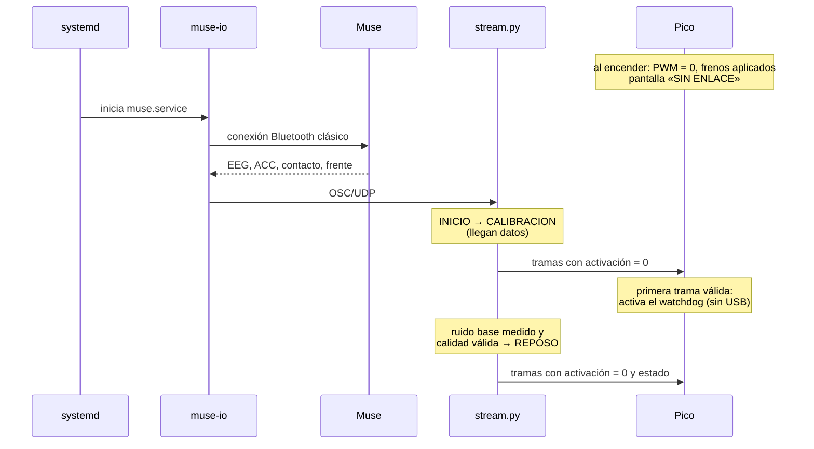
```mermaid
sequenceDiagram
  participant SY as systemd
  participant IO as muse-io
  participant M as Muse
  participant S as stream.py
  participant Q as Pico
  Note over Q: al encender: PWM = 0, frenos aplicados<br/>pantalla «SIN ENLACE»
  SY->>IO: inicia muse.service
  IO->>M: conexión Bluetooth clásico
  M-->>IO: EEG, ACC, contacto, frente
  IO->>S: OSC/UDP
  Note over S: INICIO → CALIBRACION<br/>(llegan datos)
  S->>Q: tramas con activación = 0
  Note over Q: primera trama válida:<br/>activa el watchdog (sin USB)
  Note over S: ruido base medido y<br/>calidad válida → REPOSO
  S->>Q: tramas con activación = 0 y estado
```

## Figura 21. Activación y desactivación con la cabeza inclinada (CU-02, RF-03)

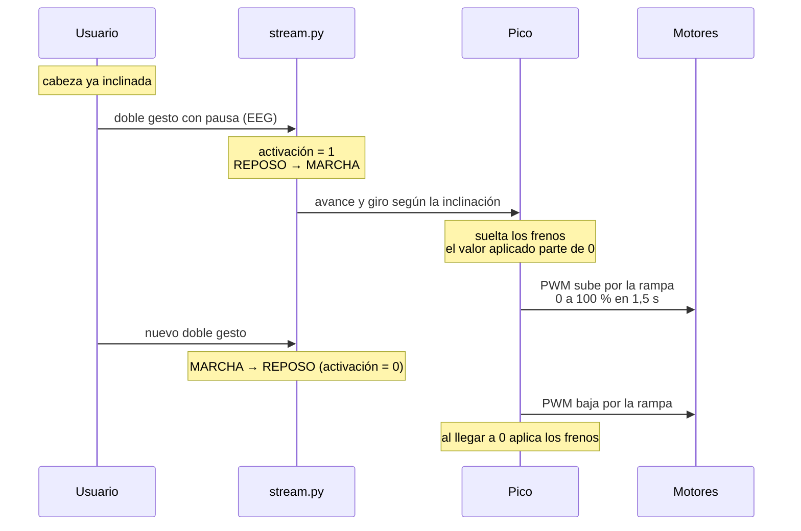
```mermaid
sequenceDiagram
  participant U as Usuario
  participant S as stream.py
  participant Q as Pico
  participant X as Motores
  Note over U: cabeza ya inclinada
  U->>S: doble gesto con pausa (EEG)
  Note over S: activación = 1<br/>REPOSO → MARCHA
  S->>Q: avance y giro según la inclinación
  Note over Q: suelta los frenos<br/>el valor aplicado parte de 0
  Q->>X: PWM sube por la rampa<br/>0 a 100 % en 1,5 s
  U->>S: nuevo doble gesto
  Note over S: MARCHA → REPOSO (activación = 0)
  Q->>X: PWM baja por la rampa
  Note over Q: al llegar a 0 aplica los frenos
```

## Figura 22. Control diferencial

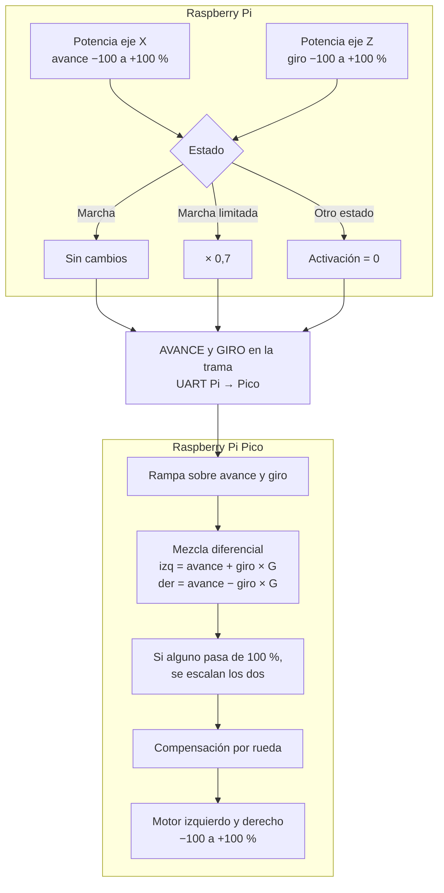
```mermaid
flowchart TD
  subgraph SPI["Raspberry Pi"]
    AX["Potencia eje X<br/>avance −100 a +100 %"] --> LIM
    AZ["Potencia eje Z<br/>giro −100 a +100 %"] --> LIM
    LIM{"Estado"}
    LIM -->|"Marcha"| N["Sin cambios"]
    LIM -->|"Marcha limitada"| L["× 0,7"]
    LIM -->|"Otro estado"| Z["Activación = 0"]
  end
  T["AVANCE y GIRO en la trama<br/>UART Pi → Pico"]
  N --> T
  L --> T
  Z --> T
  subgraph SPICO["Raspberry Pi Pico"]
    R["Rampa sobre avance y giro"]
    R --> MIX["Mezcla diferencial<br/>izq = avance + giro × G<br/>der = avance − giro × G"]
    MIX --> SAT["Si alguno pasa de 100 %,<br/>se escalan los dos"]
    SAT --> CMP["Compensación por rueda"]
    CMP --> OUT["Motor izquierdo y derecho<br/>−100 a +100 %"]
  end
  T --> R
```

## Figura 23. Generación de PWM con rampa en la Pico

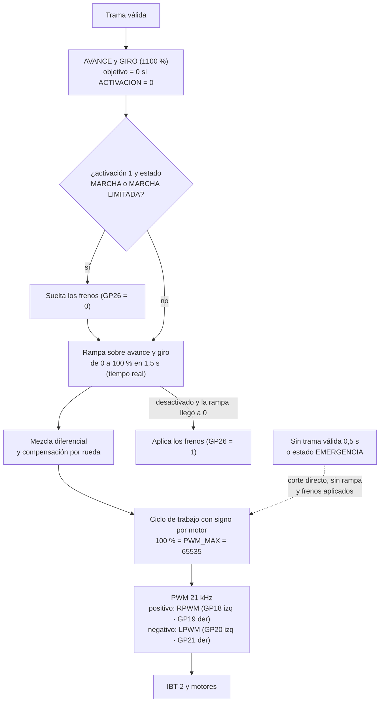
```mermaid
flowchart TD
  T["Trama válida"] --> A["AVANCE y GIRO (±100 %)<br/>objetivo = 0 si ACTIVACION = 0"]
  A --> FRS{"¿activación 1 y estado<br/>MARCHA o MARCHA LIMITADA?"}
  FRS -->|"sí"| SU["Suelta los frenos (GP26 = 0)"]
  SU --> R
  FRS -->|"no"| R["Rampa sobre avance y giro<br/>de 0 a 100 % en 1,5 s (tiempo real)"]
  R --> MIX["Mezcla diferencial<br/>y compensación por rueda"]
  MIX --> DU["Ciclo de trabajo con signo por motor<br/>100 % = PWM_MAX = 65535"]
  DU --> PW["PWM 21 kHz<br/>positivo: RPWM (GP18 izq · GP19 der)<br/>negativo: LPWM (GP20 izq · GP21 der)"]
  PW --> PH["IBT-2 y motores"]
  R -->|"desactivado y la rampa llegó a 0"| AP["Aplica los frenos (GP26 = 1)"]
  EM["Sin trama válida 0,5 s<br/>o estado EMERGENCIA"] -.->|"corte directo, sin rampa<br/>y frenos aplicados"| DU
```

## Figura 24. Cambio de sentido de un motor en la Pico

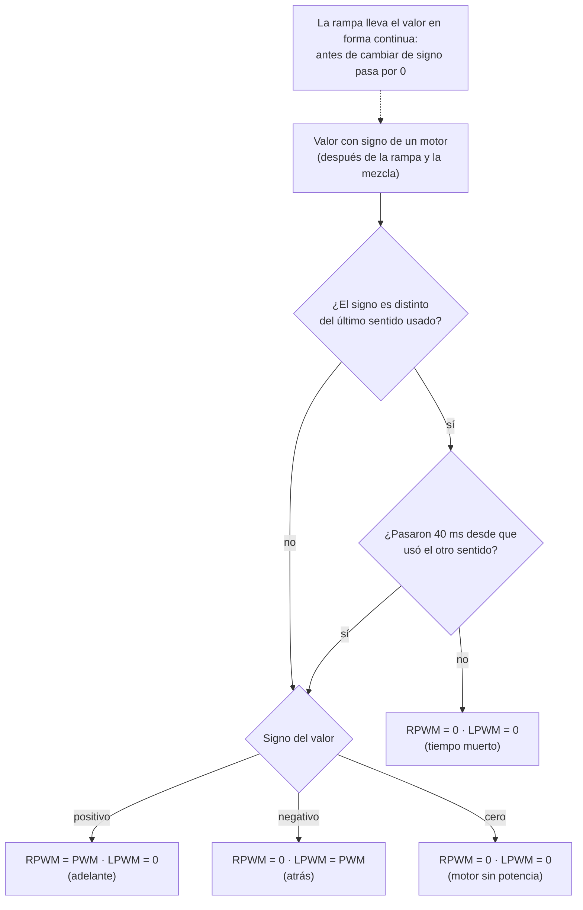
```mermaid
flowchart TD
  T["Valor con signo de un motor<br/>(después de la rampa y la mezcla)"] --> S{"¿El signo es distinto<br/>del último sentido usado?"}
  S -->|"no"| W{"Signo del valor"}
  S -->|"sí"| TM{"¿Pasaron 40 ms desde que<br/>usó el otro sentido?"}
  TM -->|"no"| Z0["RPWM = 0 · LPWM = 0<br/>(tiempo muerto)"]
  TM -->|"sí"| W
  W -->|"positivo"| AD["RPWM = PWM · LPWM = 0<br/>(adelante)"]
  W -->|"negativo"| AT["RPWM = 0 · LPWM = PWM<br/>(atrás)"]
  W -->|"cero"| FR["RPWM = 0 · LPWM = 0<br/>(motor sin potencia)"]
  NOTA["La rampa lleva el valor en forma continua:<br/>antes de cambiar de signo pasa por 0"] -.-> T
```

## Figura 26. Pérdida de enlace con la vincha

```mermaid
sequenceDiagram
  participant M as Muse
  participant P as Raspberry Pi
  participant Q as Pico
  participant X as Motores
  M->>P: datos (EEG, ACC, contactos)
  P->>Q: trama cada 50 ms (hilo de envío)
  Q->>X: PWM con rampa
  Note over M: la vincha se desconecta
  M--xP: sin datos
  Note over P: pasan 0,5 s sin ningún dato
  P->>Q: avance = giro = 0, contactos = 4,<br/>activación = 0, EMERGENCIA
  Q->>X: PWM = 0 sin rampa · frenos aplicados
  Note over P: reinicia el detector y espera la reconexión<br/>al volver: CALIBRACION
  Note over P,Q: si el procesador no renueva la trama en 0,5 s,<br/>el hilo de envío deja de mandarla
  Note over Q: si dejan de llegar tramas durante 0,5 s,<br/>corta por su cuenta y muestra SIN ENLACE
```

## Figura 27. Vigilancia del enlace y watchdog de hardware en la Pico

```mermaid
flowchart TD
  B["Arranque de la Pico<br/>PWM = 0 · frenos aplicados"] --> LP["Bucle principal cada 10 ms<br/>(hasta 40 ms al redibujar la pantalla)"]
  LP --> RX["Leer UART y validar trama"]
  RX --> FT{"¿Primera trama válida<br/>y sin USB (VBUS)?"}
  FT -->|"sí"| W["Activar watchdog<br/>de hardware (0,5 s)"]
  FT -->|"no"| TO
  W --> TO{"¿Más de 0,5 s<br/>sin trama válida?"}
  TO -->|"sí"| CUT["PWM = 0 sin rampa · frenos<br/>OLED: SIN ENLACE"]
  TO -->|"no"| RA["Rampa, sentido y PWM"]
  CUT --> FEED["Alimentar el watchdog"]
  RA --> FEED
  FEED --> LP
  LP -.->|"error en el bucle"| ERR["Motores en 0 y frenos"]
  LP -.->|"el bucle se cuelga<br/>más de 0,5 s"| RST["El watchdog reinicia la Pico:<br/>los pines quedan en 0 y el<br/>programa arranca de nuevo"]
  RST --> B
  style RST fill:#FBE3E1,stroke:#B3261E
```

## Figura 28. Salidas de monitoreo

```mermaid
flowchart LR
  subgraph SPI["Raspberry Pi · stream.py"]
    P["Hilo procesador"]
    D["Hilo detector"]
    O["Servidor OSC"]
  end
  P --> Z["ZeroMQ PUB<br/>puerto 5555<br/>mensajes JSON"]
  D --> Z
  Z --> MS["<b>Mensajes publicados</b><br/>EEG crudo 220 Hz (por lote)<br/>EEG del detector 110 Hz, crudo y filtrado<br/>DETECCION: márgenes, cocientes, vía, freno, ms y cola<br/>DEBUG_MOTOR: PWM, ejes, activación, estado, latencia_ms<br/>TRAMA_PICO: trama enviada, latencia_uart_ms<br/>ESTADO: estado nuevo, anterior y motivo de Emergencia<br/>Acelerómetro, contactos y eventos del SDK"]
  MS -.-> PC["PC de monitoreo<br/>(no interviene<br/>en el control)"]
  O -.->|"opcional"| U["Espejo UDP<br/>(mensajes OSC originales)"]
  U -.-> PC
  P -->|"trama UART"| OL
  subgraph SPICO["Pico · main.py"]
    OL["Pantalla OLED"]
    LED["LED: cambia con<br/>cada trama válida"]
  end
```

## Figura 29. Contenido de la pantalla OLED

```mermaid
flowchart TD
  T["Trama válida"] --> E["Línea superior: nombre del estado<br/>INICIO · CALIBRACION · REPOSO<br/>MARCHA · MARCHA LIMITADA · EMERGENCIA"]
  T --> C["Cara: se marca el electrodo con falla<br/>(oído o frente, izquierdo o derecho)"]
  T --> L["Última línea: TP9 FP1 FP2 TP10<br/>«ok» (1 o 2) o «__» (3 o 4)<br/>y activación A0 / A1"]
  T --> LED["LED de la Pico: cambia de estado"]
  X["Sin trama válida 0,5 s"] --> SD["«SIN ENLACE»<br/>contactos «??»"]
```

## Figura 30. Tramos de la latencia y puntos de medición

```mermaid
sequenceDiagram
  participant M as Muse
  participant S as Hilo procesador
  participant D as Hilo detector
  participant E as Hilo de envío
  participant Q as Pico
  participant H as Puente H
  M->>S: paquete (vía muse-io) · llega al buffer: t0
  Note over S: espera en el buffer hasta 50 ms
  S->>S: filtros ACC, avance y giro
  S->>D: lote EEG por la cola
  Note over D: decide cada 0,25 s con ventana de 0,5 s<br/>(gesto: hasta ≈ 0,75 s) · campo «ms»
  S->>E: trama nueva · t1
  Note over S: latencia_ms = t1 − t0 (DEBUG_MOTOR)
  Note over E: espera su turno hasta 50 ms
  E->>Q: trama UART ≈ 2 ms
  Note over E: latencia_uart_ms = escrita − t0 (TRAMA_PICO, máximo)
  Note over Q: bucle cada 10 ms
  Q->>H: PWM actualizado
  Note over S,Q: tramo de la Pico acotado por diseño ≤ 12 ms
```
